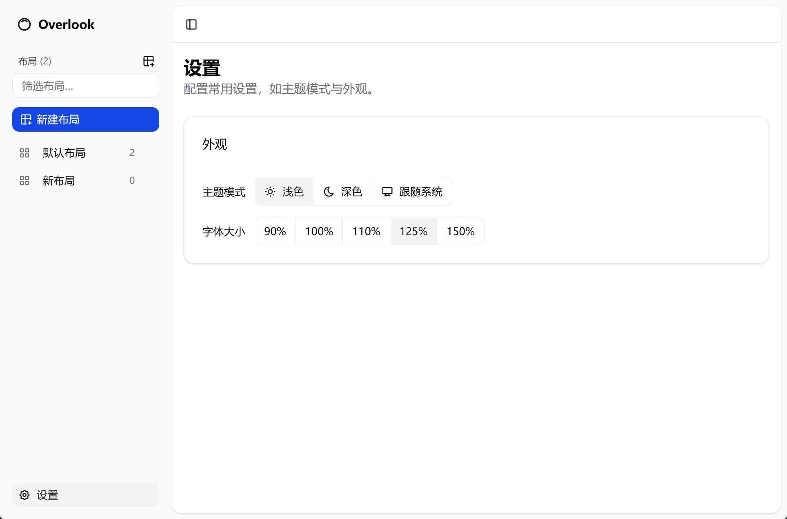
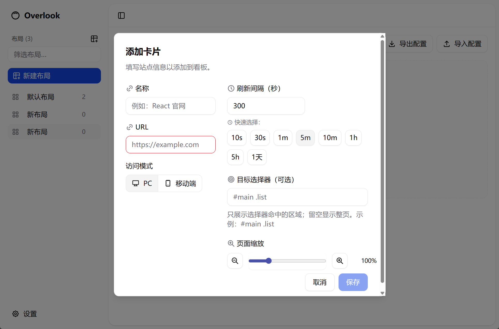
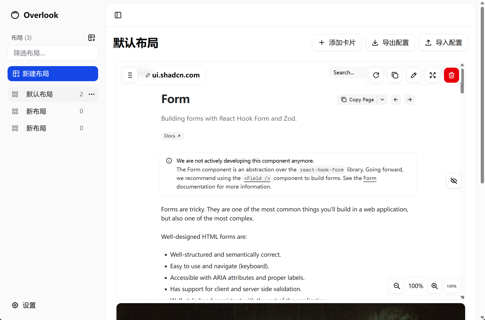
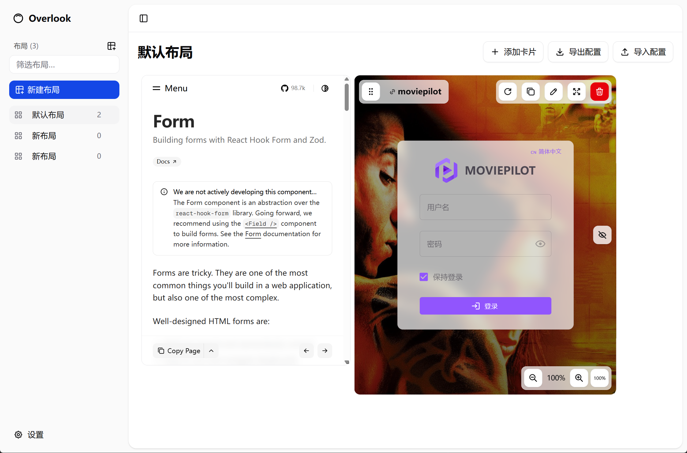

# Overlook

一个使用 Electron + React + TypeScript + Vite 构建的桌面应用，用于以网格卡片的形式快速浏览和操作网页内容。

项目地址：`https://github.com/wavesbig/overlook`

> English version below.

## 主要特性

- 网格布局的卡片面板，支持拖拽移动和尺寸调整
- 卡片工具栏：刷新、复制并添加、副本命名、编辑、全屏、删除
- 快速缩放：放大/缩小/恢复 100%，并持久化每卡片的缩放系数
- 显示/隐藏操作：通过右侧按钮切换（眼睛/隐藏眼睛图标），隐藏时完全不渲染工具栏与缩放控件
- 主题与组件：采用 `shadcn/ui`、`next-themes`、`tabler-icons-react`
- 通知提醒：使用 `sonner` 显示复制等成功提示

## 快速开始

### 环境要求

- Node.js ≥ 18
- npm（或可替换为 pnpm/yarn，但当前脚本使用 npm）

### 安装依赖

```bash
npm install
```

### 本地开发

```bash
npm run dev
```

运行后会启动 Electron 应用与 Vite 开发服务器（默认 `http://localhost:5173/`）。

### 打包构建

```bash
# Windows
npm run build:win

# macOS
npm run build:mac

# Linux
npm run build:linux
```

构建脚本由 `electron-builder` 驱动，相关配置位于 `electron-builder.yml`。

## 常用操作

- 拖拽移动：使用卡片左上角的“拖拽柄”按钮
- 刷新：点击工具栏中的刷新按钮
- 复制并添加：复制当前卡片并以“副本”追加名称，自动添加到布局底部
- 编辑：打开卡片编辑弹窗，修改 URL、缩放、选择器等配置
- 全屏：卡片全屏显示；再次点击退出
- 删除：删除当前卡片（带确认弹窗）
- 显示/隐藏操作：右侧图标按钮在“显示”与“隐藏”模式间切换；隐藏模式下工具栏与缩放控件不渲染、不可交互

## 使用说明

### 添加卡片

- 在“主看板”右上角点击“添加卡片”按钮，填写 URL、名称等配置保存即可。
- 也可将浏览器地址或链接直接拖拽到应用窗口，自动创建卡片。

### 操作卡片

- 拖拽移动：点击工具栏中的拖拽柄（“竖向握把”图标）拖动卡片位置。
- 刷新：点击刷新图标立即重新加载卡片内容。
- 复制并添加：点击“复制”图标，立即在布局底部添加该卡片的副本，名称会附加“副本”。
- 编辑：点击“铅笔”图标，打开编辑弹窗，支持修改 URL、缩放、选择器等。
- 全屏：点击“全屏/还原”图标在全屏和普通模式间切换。
- 删除：点击“删除”按钮，弹出确认后删除卡片。

### 快速缩放

- 右下角缩放控件支持“放大/缩小/重置 100%”，缩放系数会保存在卡片配置中。

### 显示/隐藏操作

- 卡片右侧的“眼睛/隐藏眼睛”图标用于切换操作显示模式。
- 显示模式：始终可见工具栏与缩放控件。
- 隐藏模式：工具栏与缩放控件完全不渲染，不会遮挡或拦截点击。

### 导入/导出

- 右上角“导出配置”可导出当前布局的 JSON；“导入配置”选择本地 JSON 即可恢复。

### 自动刷新

- 若在卡片配置中设置了 `refreshInterval`（秒），应用会在卡片可见时定期刷新其内容。

## 项目结构

```
src/
├── main/        # Electron 主进程代码（应用入口、数据存储等）
├── preload/     # 预加载脚本与类型声明
└── renderer/    # 前端渲染（React + Vite）
    ├── index.html
    └── src/
        ├── components/      # 组件（含 grid/CardItem.tsx 等）
        ├── pages/           # 页面
        ├── store/           # 状态管理（如网格布局等）
        └── lib/             # 工具函数与主题配置
```

更多目录请参考仓库根目录树与注释。

## 技术栈

- Electron、Vite、React、TypeScript
- UI：`shadcn/ui`、`tabler-icons-react`
- 主题：`next-themes`
- 通知：`sonner`

## 截图预览

下图展示了应用的主要界面与交互：

<p align="center">
  
  <br/>
  <em>截图 1：主看板布局与卡片工具栏</em>
</p>

<p align="center">
  
  <br/>
  <em>截图 2：卡片编辑与复制并添加</em>
</p>

<p align="center">
  
  <br/>
  <em>截图 3：快速缩放与全屏</em>
</p>

<p align="center">
  
  <br/>
  <em>截图 4：显示/隐藏操作（眼睛/隐藏眼睛）</em>
</p>

## 故障排查

- 页面空白或资源加载错误：
  - 确认依赖安装完整：`npm install`
  - 重新启动开发：`npm run dev`
- Electron 应用启动后无响应：
  - 关闭并重新运行开发脚本；检查控制台输出是否有报错
- 第三方资源 `net::ERR_ABORTED`：
  - 通常与依赖未安装或缓存问题有关，重新安装依赖并重启开发即可

## 推荐的 IDE 配置

- [VSCode](https://code.visualstudio.com/)
- 扩展：
  - [ESLint](https://marketplace.visualstudio.com/items?itemName=dbaeumer.vscode-eslint)
  - [Prettier](https://marketplace.visualstudio.com/items?itemName=esbenp.prettier-vscode)

## 贡献

欢迎提交 Issue 或 Pull Request。请在提交前确保本地可以运行，并通过基础的格式与类型检查。

## 许可证

当前仓库未明确许可证。如需开源发布，建议在根目录添加 `LICENSE` 文件（例如 MIT）。

---

### English

**Overlook** is a desktop app built with Electron, React, TypeScript and Vite. It provides a grid-based dashboard of webview cards with drag-and-drop, quick zoom, copy-and-add, and per-card toolbar.

Key features

- Grid layout with draggable/resizable cards
- Per-card toolbar: refresh, copy & add, edit, fullscreen, delete
- Quick zoom: zoom in/out/reset (100%) with persistence
- Toggle operations visibility via eye/eye-off icon; hidden mode fully unmounts controls
- UI based on `shadcn/ui`, `tabler-icons-react`, theming via `next-themes`
- Toast notifications via `sonner`

Getting started

- Requirements: Node.js ≥ 18
- Install: `npm install`
- Development: `npm run dev` (Electron + Vite on `http://localhost:5173/`)
- Build: `npm run build:win | build:mac | build:linux`

License

No explicit license yet. Please add a `LICENSE` file before public release.
